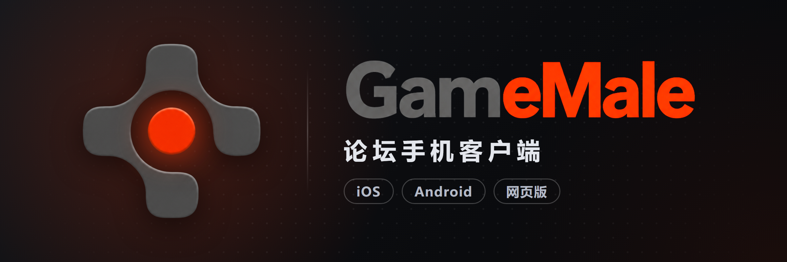
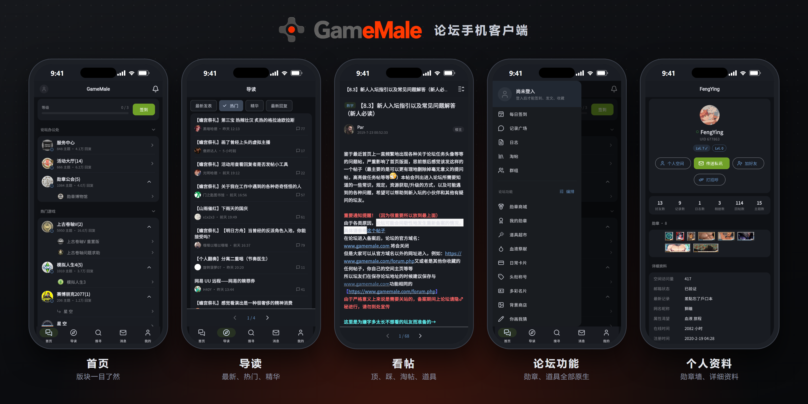

<div align="center">



<h1>GameMale 論壇客戶端</h1>

<p><b>非官方的 GameMale 論壇手機客戶端</b><br>
瀏覽、回帖、發帖、勳章、道具、日常卡片……論壇功能全部做成 App 頁面，不用再開網頁</p>

[](https://github.com/FengYing2000/GameMale-Releases/releases/latest)
[](https://github.com/FengYing2000/GameMale-Releases/releases)


<p><a href="README.md">简体中文</a> · <b>繁體中文</b></p>

<p>
<a href="#-下載"><b>📥 下載</b></a> ·
<a href="#-畫面預覽"><b>📱 畫面</b></a> ·
<a href="#-功能"><b>✨ 功能</b></a> ·
<a href="#-安裝教學"><b>📲 安裝</b></a> ·
<a href="#-問題回報"><b>💬 回報</b></a> ·
<a href="#-常見問題"><b>❓ 常見問題</b></a>
</p>

</div>

---

## 📥 下載

| 平台 | 下載 | 說明 |
| :-- | :-- | :-- |
| 🤖 **Android** | [**GitHub 下載 APK**](https://github.com/FengYing2000/GameMale-Releases/releases/latest) | Android 7 以上，下載後直接安裝 |
| 🍎 **iOS** | [**GitHub 下載 IPA**](https://github.com/FengYing2000/GameMale-Releases/releases/latest) | 需要自行側載，看下面的[安裝教學](#ios側載) |
| ☁️ **百度網盤** | [**點這裡下載**](https://pan.baidu.com/s/1ZeCVBaWmSKGvaE7zMIcDLA?pwd=ug76)（提取碼 `ug76`） | GitHub 下載太慢時用，APK、IPA 都在裡面 |
| 🌐 **網頁版** | [**852111.xyz**](https://852111.xyz) | 免安裝，iPhone、Android 都能用，加入主畫面就好 |

> [!TIP]
> GitHub 的下載頁往下拉到 **Assets** 就能看到 `.apk`（Android）和 `.ipa`（iOS）。
> 打不開或很慢的話，直接用百度網盤。

## 📱 畫面預覽

<div align="center">

</div>

## ✨ 功能

<table>
<tr>
<td width="50%" valign="top">

### 📖 瀏覽
- 首頁版塊、子版塊、置頂與分類
- 導讀：最新發表、熱門、精華、最新回覆
- 看帖：樓層、引用、點評、評分紀錄、投票
- 附件下載與購買、圖片放大
- 搜尋：帖子、用戶、日誌、相簿、群組

</td>
<td width="50%" valign="top">

### ✍️ 發帖與互動
- 回帖、發帖、編輯自己的帖子
- **直接上傳圖片**（論壇附件，太大會自動壓縮）
- 完整的編輯工具：顏色、大小、對齊、連結、引用、隱藏……
- 送出前可以**預覽**排版
- 評分、頂踩、淘帖、收藏
- **用 App 回帖一樣會觸發勳章效果**

</td>
</tr>
<tr>
<td valign="top">

### 🏅 論壇功能（全部原生頁面）
- 勳章商城、我的勳章
- 道具超市、血液祭獻、日常卡片
- 頭銜稱號、多彩名片、背景商店
- 每日簽到、任務、你畫我猜
- 記錄廣場、日誌、相簿、群組

</td>
<td valign="top">

### 💬 訊息與個人
- 私訊、提醒、未讀角標
- 個人空間、詳細資料、勳章牆、好友
- 多帳號切換，可選擇記住密碼（只存在自己的手機裡）

### 🎨 使用體驗
- 繁體／簡體介面，深色模式
- 有新版會提示，App 內就能更新
- 站長公告、問題回報與開發者回覆

</td>
</tr>
</table>

## 📲 安裝教學

### Android

1. 從上面的 GitHub 或百度網盤下載 `.apk`
2. 打開下載好的檔案安裝（第一次可能要允許「安裝不明來源的應用程式」）
3. 之後有新版，App 會提示，點一下就能下載更新

### iOS（側載）

iOS 版沒有上架 App Store，需要自行側載。**推薦 SideStore + LiveContainer**，教學很多，不會的話上網搜尋「SideStore 安裝教學」「LiveContainer 教學」。

<details>
<summary><b>點擊展開：SideStore + LiveContainer 大致流程</b></summary>

1. 照 [SideStore 官網](https://sidestore.io) 的教學，用電腦把 SideStore 裝到 iPhone（只有第一次要用電腦）
2. iPhone 打開「設定 → 隱私權與安全性 → 開發者模式」，重新開機後確認開啟
3. 到 [LiveContainer](https://github.com/LiveContainer/LiveContainer) 下載 IPA，在 SideStore 的「My Apps」點左上角 **+** 安裝
4. 下載 GameMale 的 `.ipa`，用 LiveContainer 打開匯入，之後從 LiveContainer 裡啟動
5. 免費 Apple ID 的簽名 **7 天**到期，記得在 SideStore 裡點「Refresh」續簽 LiveContainer

**好處**：GameMale 裝在 LiveContainer 裡，不佔免費帳號「最多 3 個側載 App」的名額。

</details>

<details>
<summary><b>點擊展開：其他方式</b></summary>

- **只用 SideStore**：在 SideStore 的「Sources」加入下面的來源，之後在 SideStore 裡安裝、自動更新
  ```
  https://852111.xyz/api/app/source.json
  ```
- **AltStore**：電腦裝 AltServer → 裝 AltStore → 用 AltStore 安裝 IPA（續簽時電腦要開著、同一個 Wi-Fi）
- Sideloadly 等其他側載工具也可以

</details>

### 網頁版（免安裝）

用手機打開 [**852111.xyz**](https://852111.xyz)，照畫面指示加入主畫面，之後**從主畫面的圖示打開**，就能像 App 一樣使用。

| 手機 | 怎麼加入 |
| :-- | :-- |
| iPhone | 用 **Safari** 打開 → 下方「分享」→「加入主畫面」 |
| Android | 用 **Chrome** 打開 → 右上角選單 →「安裝應用程式」或「加到主畫面」 |

> [!NOTE]
> 網頁版只能從手機主畫面打開；在瀏覽器分頁或電腦上打開，只會看到加入主畫面的說明。
> 在 LINE、Telegram 等 App 裡點開的連結沒辦法加入，請先選「用瀏覽器開啟」。

## 🔄 更新

- **App 內提示**：有新版時打開 App 會提示，可以選 GitHub 或百度網盤下載
- **SideStore 來源**：加了來源的話，SideStore 會自己提醒、一鍵更新
- **網頁版**：重新打開就是最新版
- **更新日誌**：每一版的內容寫在 [Releases](https://github.com/FengYing2000/GameMale-Releases/releases)，App 的「設定 → 版本與更新 → 更新日誌」也看得到

## 💬 問題回報

> [!IMPORTANT]
> 問題回報請用 **App 內回報** 或 **論壇私訊**，不在 GitHub 處理。

- **「回報」小按鈕（最方便）**：畫面邊緣的小按鈕，在出問題的那一頁按一下，會自動附上當下畫面的截圖、版本和裝置（不想給人看的截圖送出前可以拿掉）。小按鈕可以在「設定 → 版本與更新」關掉
- **我的 → 回報問題**：一樣能回報；右上角「我的回報」看得到處理狀態和開發者的回覆
- **論壇私訊**：需要附錄影、或帳號相關的問題
- 想要的新功能、覺得不好用的地方也歡迎提

## 🔒 隱私

- 帳號只存在你自己的手機裡，**不會**上傳密碼或任何登入憑證
- App 直接連論壇；網頁版經由轉發伺服器連到論壇，伺服器不保存帳號資料
- 登入後會記下論壇暱稱、UID、裝置型號、系統和 App 版本、使用時間，用來統計和排查問題；**沒登入不記錄**
- 會花金幣、積分的操作（買勳章、兌換……）都會先確認

## ❓ 常見問題

<details>
<summary><b>這是官方的 App 嗎？</b></summary>

不是。這是非官方的客戶端，與 GameMale 官方無關；所有內容都來自論壇本身，帳號就是你的論壇帳號。

</details>

<details>
<summary><b>用 App 回帖會觸發勳章效果嗎？</b></summary>

會。勳章的回帖加成、觸發機率都和網頁版一樣，血液、金幣照賺。

</details>

<details>
<summary><b>iOS 為什麼要側載？每 7 天要重簽？</b></summary>

因為沒有上架 App Store。用免費 Apple ID 側載的 App 簽名 7 天到期，到期前在 SideStore 點「Refresh」續簽就好；用 LiveContainer 的話只要續簽 LiveContainer 本身。

</details>

<details>
<summary><b>網頁版和 App 有什麼不一樣？</b></summary>

功能基本一樣。網頁版不用安裝、不用續簽；App 直接連論壇，速度更快。iPhone 不想側載的話用網頁版就好。

</details>

<details>
<summary><b>GitHub 下載很慢／打不開？</b></summary>

用上面的百度網盤（提取碼 `ug76`），App 的更新提示裡也可以選百度網盤。

</details>

## 📦 關於這個倉庫

這裡只放**安裝檔**：每一版由 GitHub Actions 自動編譯，安裝檔附在各個 [Release](https://github.com/FengYing2000/GameMale-Releases/releases) 裡。

---

<div align="center">
<sub>非官方客戶端，與 GameMale 官方無關 · 由 FengYing 規劃、測試與發佈，程式由 Claude（AI）協助撰寫</sub>
</div>
